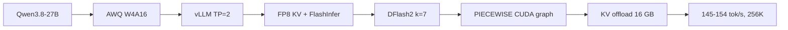
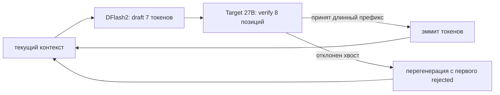
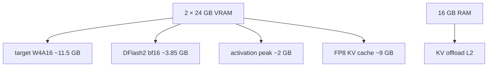

# Как повторить: Qwen3.8-27B на 2×RTX 3090

> Публичная техническая заметка к докладу **«1 млрд токенов в сутки на потребительских видеокартах»**
> (Data Fest Siberia 7, Новосибирск, 10 октября 2026).
>
> Здесь — сжатая суть того, как получить быстрый и стабильный self-hosted инференс
> **Qwen3.8-27B** на **2×RTX 3090 (24 GB)**: алгоритм, схемы, примеры конфигов vLLM
> (до кастомных патчей движка), результаты прогонов и публичные эталоны.
>
> Слайды: [slides-export.pdf](https://github.com/axsapronov/datafestsiberia7-self-hosted-llm/blob/main/slides-export.pdf) ·
> репозиторий доклада: [axsapronov/datafestsiberia7-self-hosted-llm](https://github.com/axsapronov/datafestsiberia7-self-hosted-llm)

---

## 1. Итог

Один узел **2×RTX 3090** с **Qwen3.8-27B** в AWQ W4A16 и спекулятивным декодированием:

| Метрика | Результат |
|---|---:|
| Single-stream decode (multi-session, `max-num-batched-tokens=2048`) | **~145 tok/s** |
| Single-stream decode (single-user, `max-num-batched-tokens=8192`) | **~154 tok/s** |
| Aggregate throughput, 5 параллельных запросов | **~420 tok/s** |
| TTFT (короткий prompt, warm) | **~220 ms** |
| ITL p50 / p95 / p99 | **~35 / 41 / 46 ms** |
| Prefill ~20K токенов | **~1430 tok/s** |
| KV-пул | **~469K токенов** (1.79× от 256K) |
| Конкурентность 256K | **4×256K** с 16 GB KV-offload, 0 preemptions |
| DFlash2 acceptance | **~52%**, **~3.6 токена/verify-step** |
| Стабильность | **0 restarts**, 0 Xid / OOM в протоколе |

Прогрессия по decode (count-100, median):

```text
MTP baseline, stock            78 |████████
DFlash2, сломанный cudagraph   54 |██████
DFlash2 + PIECEWISE cudagraph 139 |████████████████
Production 256K (final)       146 |████████████████
Single-user 8192              154 |█████████████████
```

Главный вывод: **крупный прирост даёт не «ещё одна опция», а сочетание**
W4A16-весов, FP8 KV-кэша, DFlash2-драфтера и правильного CUDA-graph режима.

---

## 2. Алгоритм воспроизведения



По шагам:

1. **Зафиксировать бюджет VRAM.**
   2×24 GB = 48 GB. На них должны поместиться: веса таргета, drafter,
   activation peak и KV-кэш. Для 27B на consumer GPU это означает W4A16-веса.

2. **Выбрать таргет в AWQ W4A16.**
   Ampere (sm_86) не умеет FP8-вычисления, поэтому веса — INT4/W4A16,
   а KV-кэш — FP8 (`fp8_e4m3`) для экономии памяти.

3. **Поднять vLLM с TP=2 и 256K контекста.**
   Базовые флаги: `--tensor-parallel-size 2`, `--max-model-len 262144`,
   `--gpu-memory-utilization 0.95`, `--attention-backend FLASHINFER`,
   `--kv-cache-dtype fp8_e4m3`.

4. **Добавить спекулятивное декодирование.**
   Два рабочих варианта:
   - **MTP** — встроенные MTP-головы таргета, проще, `num_speculative_tokens=3`;
   - **DFlash2** — отдельная block-diffusion draft-модель, `num_speculative_tokens=7`.
   Для нашего workload выиграл DFlash2 при работающем PIECEWISE CUDA graph.

5. **Не ломать CUDA graph.**
   Не задавать явно `FULL_DECODE_ONLY` для FlashInfer + spec-decode.
   Дефолтный путь деградирует до **PIECEWISE**, и именно он дал главный прирост.

6. **Настроить `max-num-batched-tokens` под цель.**
   - `2048` — больше KV-пула (+28%), лучше concurrency, decode чуть ниже;
   - `8192` — выше single-request decode, меньше KV-пул.
   Для multi-session агентного деплоя выбрали `2048`.

7. **Добавить KV-offload для 256K-конкурентности.**
   `--kv-offloading-size 16 --kv-offloading-backend native --enable-cumem-allocator`
   даёт 16 GB RAM как L2-кэш KV и поднимает потолок до **4×256K** без preemptions.

8. **Измерять единым протоколом.**
   count-100, prose, code, TTFT/ITL, 5-parallel, long-context и acceptance
   из дельт `/metrics`. Менять одну переменную за раз.

---

## 3. Почему именно так на consumer GPU

| Ограничение 3090 | Последствие | Решение |
|---|---|---|
| Ampere sm_86, нет FP8 compute | FP8-веса/вычисления не доступны | **W4A16 (AWQ)** для весов |
| 24 GB VRAM на карту | KV-кэш в BF16 быстро упирается в память | **FP8 KV-кэш** (`fp8_e4m3`) |
| Нет NVLink между картами | P2P all-reduce может деградировать | `NCCL_P2P_DISABLE=1` (SHM-путь) |
| 256K контекст не помещает много резидентов | KV-пул — binding constraint | `max-num-batched-tokens=2048` + **KV-offload** |
| Decode упирается в пропускную способность памяти | 1 токен/шаг — дорого | **Speculative decoding** (DFlash2 / MTP) |

---

## 4. Конфиги vLLM (до кастомных патчей движка)

Ниже — **stock vLLM 0.30**, без кастомных патчей движка.
Это базовый воспроизводимый рецепт.

> Важно: в нашем production-образе дополнительно используются патчи под
> гибридную Mamba-архитектуру, async-scheduling и квантованные draft-модули.
> Для первого запуска их **не нужно**: берём bf16 DFlash2-драфтер и не включаем
> `--async-scheduling`.

### 4.1 Общие env

```bash
export CUDA_VISIBLE_DEVICES=0,1
export VLLM_NO_USAGE_STATS=1

# меньше фрагментация VRAM
export PYTORCH_CUDA_ALLOC_CONF=expandable_segments:True

# 3090 без NVLink: SHM-путь быстрее деградировавшего P2P
export NCCL_P2P_DISABLE=1

# CPU-side параллелизм
export OMP_NUM_THREADS=4
```

### 4.2 Baseline: MTP (встроенные MTP-головы)

```bash
vllm serve shawnw3i/Qwen3.8-27B-AWQ-MTP \
  --served-model-name qwen3.8-27b \
  --tensor-parallel-size 2 \
  --language-model-only \
  --dtype bfloat16 \
  --gpu-memory-utilization 0.95 \
  --max-model-len 262144 \
  --max-num-seqs 6 \
  --max-num-batched-tokens 2048 \
  --attention-backend FLASHINFER \
  --kv-cache-dtype fp8_e4m3 \
  --mamba-ssm-cache-dtype bfloat16 \
  --long-prefill-token-threshold 4096 \
  --disable-custom-all-reduce \
  --speculative-config '{"method":"mtp","num_speculative_tokens":3}'
```

Это честный baseline: AWQ-таргет с MTP-головами в чекпоинте, без отдельного драфтера.

### 4.3 Рекомендуемый: DFlash2 (отдельный block-diffusion drafter)

```bash
vllm serve TheUnderscore/Swift-Qwen3.8-27b-W4A16-AWQ \
  --served-model-name qwen3.8-27b \
  --tensor-parallel-size 2 \
  --language-model-only \
  --dtype bfloat16 \
  --gpu-memory-utilization 0.95 \
  --max-model-len 262144 \
  --max-num-seqs 6 \
  --max-num-batched-tokens 2048 \
  --attention-backend FLASHINFER \
  --kv-cache-dtype fp8_e4m3 \
  --mamba-ssm-cache-dtype bfloat16 \
  --long-prefill-token-threshold 4096 \
  --disable-custom-all-reduce \
  --speculative-config '{
    "method": "dflash",
    "model": "incoai/Qwen3.8-27B-DFlash2",
    "num_speculative_tokens": 7
  }'
```

Ключевые детали:

- `incoai/Qwen3.8-27B-DFlash2` — **bf16** drafter (~3.85 GB). Для stock vLLM это самый простой путь.
- `num_speculative_tokens=7` — trained block размера 8 (7 draft + verify-позиция).
  Увеличивать «впрок» не стоит: см. [сweep по k](#63-почему-k7-оптимум).
- Не задаём `--compilation-config` — даём vLLM выбрать рабочий PIECEWISE-режим.
- Не включаем `--async-scheduling` в stock-сборке: на гибридной Mamba-модели
  без патчей это может дать CUDA-гонку на длинных ранах.

### 4.4 Опционально: 256K-конкурентность через KV-offload

Добавить к предыдущему конфигу:

```bash
  --kv-offloading-size 16 \
  --kv-offloading-backend native \
  --enable-cumem-allocator
```

Для Docker:

```bash
docker run --gpus all --shm-size 24g ...
```

Что это даёт:

- GPU KV-пул остаётся примерно тем же (offload — это RAM L2-кэш, а не рост VRAM);
- при переполнении GPU-пула блоки свапятся в 16 GB RAM **без рекомьюта**;
- потолок поднимается с ~2×256K до **4×256K** (0 preemptions в нашем прогоне).

### 4.5 Что включать осторожно

| Флаг | Когда имеет смысл |
|---|---|
| `--enable-prefix-caching` | агентные multi-turn саны с повторяющимися system/tool-блоками |
| `--async-scheduling` | только в сборке, где закрыты гонки hybrid Mamba + spec-decode |
| `draft_sample_method: probabilistic` | sampling-workload; на детерминированном count-100 (temp=0) у нас дал регрессию |
| `--compilation-config '{"cudagraph_mode":"FULL_DECODE_ONLY"}'` | **не надо** для FlashInfer + spec-decode: у нас была рецессия ×2.6 |

---

## 5. Ключевые рычаги и почему они работают

| Рычаг | Что делает | Эффект в наших замерах |
|---|---|---|
| **W4A16 (AWQ)** | влезает 27B в 2×24 GB | базовое условие |
| **FP8 KV (`fp8_e4m3`)** | KV-кэш в 2× компактнее BF16 | больше 256K-резидентов |
| **DFlash2 k=7** | 7 draft-токенов за один block-diffusion forward | **~52% acceptance**, ~3.6 tok/step |
| **PIECEWISE CUDA graph** | decode-графы без деградации до NONE | **53.7 → 139.4 tok/s** (×2.6) |
| **`max-num-batched-tokens=2048`** | меньше activation peak → больше KV-пула | **+28% KV-пул**, цена ~−5% decode |
| **`NCCL_P2P_DISABLE=1`** | SHM all-reduce вместо деградировавшего P2P | +3.8% decode, +11.7% 5-parallel |
| **KV-offload 16 GB** | RAM L2-кэш для KV при переполнении | **4×256K** без preemptions |

Схема спекулятивного шага:



Схема VRAM-бюджета (2×24 GB):



---

## 6. Результаты прогонов

Все цифры — median по протоколу из [§7](#7-как-мерить).
Разные ноды/recreate дают ±10% шум, поэтому для выводов важнее
структурные метрики: KV-пул, acceptance, preemptions, ITL.

### 6.1 Прогрессия конфигураций

| Стадия | Конфиг | count-100 | 5-parallel | KV-пул | Комментарий |
|---|---|---:|---:|---:|---|
| Baseline | MTP k=3, stock | **77.9** | 185.4 | ~278K | рабочая точка отсчёта |
| DFlash2, сломанный CG | DFlash2 k=7 + `FULL_DECODE_ONLY` | 53.7 | 234.7 | ~278K | cudagraph деградировал до NONE |
| **DFlash2 + PIECEWISE** | DFlash2 k=7, дефолтный cudagraph | **139.4** | 352.7 | ~275K | главный скачок |
| + `batched-tokens=2048` | то же + KV-оптимизация | 135.9 | 395.1 | **412K** | +50% KV-пул |
| Production 256K | + патчи стабильности | **145.7** | **420.5** | **469K** | финальный multi-session |
| Single-user 8192 | fine-tuned bf16 drafter, `batched=8192` | **~154** | 424.4 | 374K | максимум per-req decode |
| Multi-session 2048 | fine-tuned bf16 drafter, `batched=2048` | 145.1 | 408.5 | **479K** | баланс decode/concurrency |

### 6.2 Финальный срез (multi-session 256K)

| Метрика | Значение |
|---|---:|
| count-100 (12 warm) | **145.7 tok/s** |
| prose 500-tok | **69.8 tok/s** |
| code 400-tok | **121.4 tok/s** |
| TTFT | **~224 ms** |
| ITL p50/p95/p99 | **35 / 41 / 46 ms** |
| long-ctx prefill ~20K | **~1429 tok/s** |
| 5-parallel aggregate | **420.5 tok/s** |
| 5-parallel per-req | **~84 tok/s** |
| DFlash2 acceptance | **52.0%** (mean 3.64 tok/step) |
| per-position acceptance p0→p6 | 0.805 → 0.373 |
| KV-пул | **469 543 токенов** (1.79×) |
| 2×200K long-ctx | 0 preemptions |
| 4×256K (с offload 16 GB) | **0 preemptions**, no OOM |
| restarts / Xid / OOM | **0 / none / none** |

### 6.3 Почему k=7 — оптимум

DFlash2-чекпоинт обучен на блоке 8. Увеличение `num_speculative_tokens`
заставляет drafter/verify работать вне trained-режима:

| k (draft tok) | count-100 | acceptance | 5-parallel | Вывод |
|---:|---:|---:|---:|---|
| **7** | **136.0** | **47.9%** | **405.4** | оптимум |
| 9 | 116.9 | 39.7% | 392.2 | хуже |
| 11 | 120.4 | 34.3% | 395.0 | хуже |
| 13 | 117.8 | 27.6% | 330.4 | явно хуже |
| 15 | 119.2 | 23.1% | 314.9 | худший |

Причина: per-position acceptance обрывается после ~7 позиций.
Дополнительные draft-токены почти не принимаются, но дорого верифицируются.

### 6.4 Квант драфтера: bf16 vs W8A16

| Drafter | VRAM | acceptance | count-100 | Вывод |
|---|---:|---:|---:|---|
| **fine-tuned bf16** | 3.85 GB | **50.7%** | **~154** | быстрее |
| fine-tuned W8A16 AWQ | 2.08 GB | 47.9% | 139.9 | экономит 1.77 GB VRAM |

W8A16-квант драфтера — tradeoff: минус ~2.8 pts acceptance и ~3% decode
взамен за 1.77 GB VRAM. Для 2×3090 с достаточным KV-пулом **bf16 лучше**.
Точные цифры выше — с обученным под таргет drafter; на публичном
`incoai/Qwen3.8-27B-DFlash2` ожидайте тот же порядок (~145–150 tok/s).

---

## 7. Как мерить

Единый протокол A/B (без него цифры не сопоставимы):

1. **count-100** — главная decode-метрика.
   - prompt: «Count 1..100», `max_tokens=100`, `temperature=0`;
   - 2 warmup-прогона отбрасываются;
   - 12 warm-прогонов; metric = `generated_tokens / total_s`;
   - берём **median**.

2. **prose / code** — сложные для drafter'а нагрузки.
   - prose: 500 токенов, 3 прогона;
   - code: 400 токенов, 3 прогона.

3. **TTFT / ITL** — streaming, 3 прогона.
   - TTFT: median;
   - ITL: p50/p95/p99 по всем интервалам.

4. **5-parallel** — aggregate throughput.
   - 5 параллельных count-100;
   - aggregate = сумма generated tokens / wall time;
   - per-req = median по запросам.

5. **Long-context prefill** — чистый prefill.
   - ~20K токенов, needle=42;
   - **свежий seed каждый прогон** (иначе попадание в prefix cache).

6. **Acceptance** — из дельт `/metrics` до/после прогона:
   - `acceptance % = Δaccepted_tokens / Δdraft_tokens`;
   - `mean acceptance length = Δaccepted_tokens / Δdrafts` (tok/verify-step);
   - per-position: `spec_decode_num_accepted_tokens_per_pos_total / Δdrafts`.

Правила:

- **≥3 прогонов** на конфигурацию;
- **одна переменная** за раз (checkpoint / drafter / k / batched-tokens / патчи);
- проверить **0 restarts** и отсутствие Xid/OOM/Traceback в логе;
- счётчики `/metrics` кумулятивны — считать только **дельты**.

---

## 8. Модели и чекпоинты (Qwen 27B)

### Таргет

| Чекпоинт | Назначение |
|---|---|
| [TheUnderscore/Swift-Qwen3.8-27b-W4A16-AWQ](https://huggingface.co/TheUnderscore/Swift-Qwen3.8-27b-W4A16-AWQ) | AWQ W4A16, основной таргет в наших замерах |
| [ukisai/Swift-1.5-Qwen3.8-27b-W4A16-AWQ](https://huggingface.co/ukisai/Swift-1.5-Qwen3.8-27b-W4A16-AWQ) | Swift 1.5, reasoning-efficient, AWQ W4A16 |
| [shawnw3i/Qwen3.8-27B-AWQ-MTP](https://huggingface.co/shawnw3i/Qwen3.8-27B-AWQ-MTP) | AWQ + MTP-головы в весах (baseline) |
| [dbirks/Qwen3.8-27B-W4A16-AutoRound](https://huggingface.co/dbirks/Qwen3.8-27B-W4A16-AutoRound) | W4A16 AutoRound (A/B-таргет) |

### Drafter

| Чекпоинт | Назначение |
|---|---|
| [incoai/Qwen3.8-27B-DFlash2](https://huggingface.co/incoai/Qwen3.8-27B-DFlash2) | **DFlash2 bf16** (~3.85 GB), работает в stock vLLM |
| [syvai/Qwen3.8-27B-DFlash2-W4A16](https://huggingface.co/syvai/Qwen3.8-27B-DFlash2-W4A16) | DFlash2 W4A16 (~1.2 GB), нужен патч движка |

---

## 9. Спекулятивное декодирование: MTP vs DFlash2

| | MTP | DFlash2 |
|---|---|---|
| Что это | встроенные MTP-головы таргета | отдельная block-diffusion draft-модель |
| Токенов за шаг | 3 (chained) | 7 за один forward |
| Отдельный KV drafter'а | нет (делит KV таргета) | да (precomputed context-KV) |
| Acceptance (наши данные) | ~76–79% | ~45–52% |
| Mean tok/verify-step | ~3.2–3.6 | ~3.3–3.6 |
| Когда выигрывает | 256K-ёмкость, 8+ потоков, prose | single-user 80k–150k, PIECEWISE graph |
| Главный риск | рост draft-attention с контекстом | VRAM drafter'а, prefill-налог |

**Коротко:** «MTP всегда лучше на длинном контексте» — не универсальная истина.
На идентичном 2×3090 W4A16-стеке DFlash2 обычно быстрее на 80k–150k,
а MTP выигрывает по ёмкости 256K и мульти-юзер конкурентности.

Публичные источники по алгоритму:

- DFlash / DFlash2: [arXiv:2602.06036](https://arxiv.org/abs/2602.06036) ·
  [z-lab/dflash](https://github.com/z-lab/dflash) ·
  [vLLM speculators docs](https://docs.vllm.ai/projects/speculators/en/latest/user_guide/algorithms/dflash2/)
- MTP: [vLLM MTP docs](https://docs.vllm.ai/en/stable/features/speculative_decoding/mtp)
- Speculative decoding (основа): [arXiv:2211.17192](https://arxiv.org/abs/2211.17192)

---

## 10. Эталоны и сообщество

Публичные репозитории, откуда берутся рецепты и независимые цифры:

| Репозиторий | Что даёт |
|---|---|
| [noonghunna/club-3090](https://github.com/noonghunna/club-3090) | **community-рецепты для 1×/2×/N× RTX 3090**: vLLM/llama.cpp/SGLang, compose-конфиги, патчи, бенчмарки |
| [tonyd2wild/Qwen3.8-27B-DFLASH2-AutoRound-W4A16-2x3090](https://github.com/tonyd2wild/Qwen3.8-27B-DFLASH2-AutoRound-W4A16-2x3090) | ближайший аналог: 2×3090, W4A16 + DFlash2 + FP8 KV; DFlash2 101.1 vs MTP 77.8 tok/s |
| [syv-ai/qwen38-27b-rtx3090](https://github.com/syv-ai/qwen38-27b-rtx3090) | 1×3090: тюнёный MTP-стек (111–120 tok/s) vs DFlash2 |
| [alesha-pro/qwen38-27b-bench-4x3090](https://github.com/alesha-pro/qwen38-27b-bench-4x3090) | 4×3090: vLLM vs SGLang бенчмарки |

---

## 11. Что не сработало (честно)

| Попробовали | Ожидали | Получили |
|---|---|---|
| `FULL_DECODE_ONLY` cudagraph | быстрее PIECEWISE | **рецессия ×2.6** (деградация до NONE) |
| `draft_sample_method=probabilistic` | +20% как в чужих стеках | **−23%** на детерминированном count-100 |
| k=11/15 для DFlash2 | больше токенов за шаг | acceptance падает, prose −35% |
| LOOKUP/CHAIN drafting | больше принятых токенов | нейтрально / вредит acceptance на стандартном бенче |
| W8A16-квант драфтера | экономия VRAM без потерь | **−2.8 pts acceptance**, −3% decode |
| `max-num-batched-tokens=8192` для multi-session | быстрее | меньше KV-пул (−21%), хуже concurrency |
| OMP_NUM_THREADS=1 | меньше contention | −4% decode (не переносится с других стеков) |

---

## 12. Чек-лист воспроизведения

- [ ] 2×RTX 3090 (24 GB), driver, Docker + NVIDIA Container Toolkit
- [ ] vLLM **0.30** (stock, без кастомных патчей)
- [ ] Таргет: AWQ W4A16 чекпоинт Qwen3.8-27B
- [ ] Drafter: `incoai/Qwen3.8-27B-DFlash2` (bf16)
- [ ] Запуск по [§4.3](#43-рекомендуемый-dflash2-отдельный-block-diffusion-drafter)
- [ ] В логе: `cudagraph PIECEWISE`, KV-пул ~470K, 0 Xid/OOM
- [ ] Прогнать протокол из [§7](#7-как-мерить)
- [ ] Сверить: count-100 ~140–150, acceptance ~50%, 5-parallel ~400+
- [ ] При необходимости добавить KV-offload ([§4.4](#44-опционально-256k-конкурентность-через-kv-offload))

---

*Собрал: Александр Сапронов · [t.me/axsapronov](https://t.me/axsapronov) · [a@sapronov.me](mailto:a@sapronov.me)*
