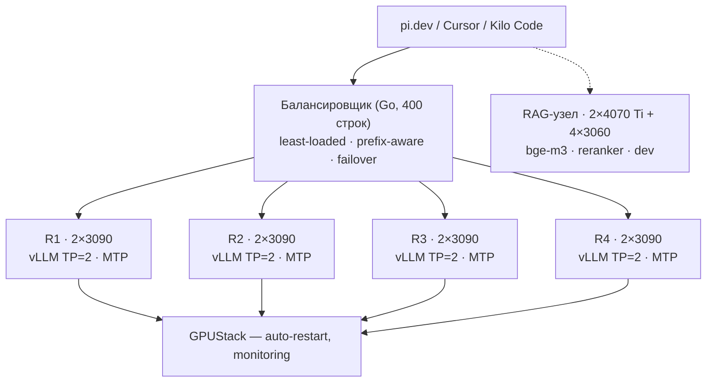

<div class="title">

# 1 млрд токенов <span class="title-sub">в сутки</span><br>на потребительских видеокартах

</div>

<CoverBrand />

<div class="cover-meta">
  <div class="cover-author">Александр Сапронов</div>
  <div class="cover-contacts"><a href="https://t.me/axsapronov">t.me/axsapronov</a></div>
  <div class="cover-date">Data Fest Siberia 7 · Новосибирск · 10 октября 2026</div>
</div>

<div class="cover-proof">
  
</div>

<!--
Приветствие, представление, 1-2 минуты.
-->

---
layout: two-cols
hideInToc: true
---

<div class="slidev-slide-number"><SlideCurrentNo /> / <SlidesTotal /></div>

# План доклада

::left::

<Toc minDepth="1" maxDepth="1" />

::right::

<div class="speaker-card">
  
  <div class="speaker-name">Александр Сапронов</div>
  <div class="speaker-role">IT Manager (CTO)</div>
  <div class="speaker-bio">Решаю бизнес задачи в IT. <br>МТС, Avito, Welltory</div>
  <div class="speaker-contacts"><a href="https://t.me/axsapronov">t.me/axsapronov</a> · <a href="mailto:a@sapronov.me">a@sapronov.me</a></div>
</div>

---
hideInToc: false
title: Зачем собирать свою ИИ-инфраструктуру?
---

<div class="slidev-slide-number"><SlideCurrentNo /> / <SlidesTotal /></div>

# ИИ в 2026 — удобная и дорогая технология


<!--
ИИ - это дорогая технология, которая стремится снизить себестоимость на масштабе.
Идея «удобная и дорогая технология» — на графике Ramp Top-1% ($/сотрудник/мес). Три фазы:
1) 2023 – early 2025 — FLAT, ~$160: Chat + RAG, удобно, но расход плоский;
2) mid-2025 – early 2026 — ACCELERATION, 4× YoY до $2,470: Claude Code + MCP + Computer Use — первый настоящий agentic era;
3) mid-2026 → — EXPLOSION, ~$9,000: frontier agents, 1M+ context, GPT-6 Astra.
Каждая эра (Chat → ReAct → Reasoning → Agents → Multi-agent → Computer Use → Frontier)
умножает токенов на задачу в ~10×, и каждая ключевая модель (GPT-5, Claude, Gemini, GPT-6) —
новая ступень расхода. Удобно: агенты делают работу. Дорого: платит вся компания — «AI tax».
-->

<div class="hook-line">Компании хотят возврата инвестиций, так что открывайте кошелек шире</div>

---
hideInToc: true
class: timeline-slide
---

<div class="slidev-slide-number"><SlideCurrentNo /> / <SlidesTotal /></div>

# IT в 2026 — полоса юридических препятствий

<RegulatoryTimeline />


<div class="hook-line">Для данных существуют границы и незаконное пересечение имеет последствия</div>

<!--

Риски
- Юридические
- Финансовые
- Репутационные
-->

<!--
Полный регуляторный таймлайн (даты вступления в силу):
2000 COPPA (США, дети <13) · 2002 ePrivacy (ЕС, cookies) · 2006 152-ФЗ (РФ, ПДн)
2014 242-ФЗ (РФ, локализация ПДн) · 2018 GDPR (ЕС, штрафы до 4% выручки, DPO, 72ч)
2020 CCPA (США) + Schrems II (CJEU, недействителен Privacy Shield → только SCC + TIA)
2020 LGPD (Бразилия) · 2021 PIPL (Китай, до 5% выручки)
2023 DPDP (Индия) + 12+ штатов США (VCDPA, CPA, CTDPA, OCPA, UCPA, ICPA)
2024 EU AI Act (риск-модель) · 2025 420-ФЗ (РФ, штрафы до 500 млн ₽ / 3% выручки, уголовка до 10 лет)
2025 EU Data Act (portability, cloud switching) · 2026 EU AI Act — full application (high-risk, Art. 50)

Ключевой нарратив: IT-отрасль прошла путь от «wild west» до heavily regulated industry.
IT-компания сегодня обязана иметь: consent-менеджмент, data localization, breach notification
(72ч в ЕС / 24ч в РФ), DPO, transfer impact assessments (Schrems II), AI governance,
audit trails, right to be forgotten. Это не опциональная надстройка, а базовый compliance-контур.
-->

---
hideInToc: true
---

<div class="slidev-slide-number"><SlideCurrentNo /> / <SlidesTotal /></div>

# Гибридная инфраструктура — способ решения


<div class="hook-line">Cloud — чтобы быстро двигаться, self-hosted — чтобы долго двигаться</div>

<!--
Cloud - чтобы быстро двигаться, Self-hosted - чтобы долго двигаться

- **Cloud** — frontier-модели: сложный reasoning, пики трафика, эксперименты
- **Self-hosted** — рутина, приватные данные, 24/7-нагрузка: без лимитов и без счёта

Риски
- Юридические
- Финансовые
- Репутационные
-->

---
title: Что ожидают пользователи?
---

<div class="slidev-slide-number"><SlideCurrentNo /> / <SlidesTotal /></div>

# Что ожидают пользователи


<div class="hook-line">Dogfooding — ключ к пониманию требований</div>

<!--
Требования сформулированы через dogfooding: моя команда первые месяцы работала через
эту инфраструктуру, и «боль» стала списком требований. Поиск по Reddit и блогам 2026
показал: это не «завышенные» запросы, а стандарт года.

Скорость: 80–100 tok/s на одиночный запрос — нижняя граница «не раздражает».
Опрос r/LocalLLaMA: 8–12 tok/s — минимум для кода, 15–25 — «терпимо для чата».
8000 токенов при 16 tok/s = 8 минут на один ответ — точка, где бросают локальные модели.
Overthinking (Qwen3.8, Simon Willison 2026-08-16) = 5–10× больше output = 5–10× дольше ожидание.

Конкурентность: 3–4 человека одновременно без просадки — стандарт 2026 для команды
3–4 разработчиков. Порог: «4+ concurrent users — vLLM batching wins» (Ollama 12 vs vLLM 80 tok/s).
Агенты (pi.dev, Cursor, Kilo) создают 3–10 параллельных запросов на человека, а не 1.
Люди прощают, что один запрос медленнее, но не прощают, что все запросы одновременно становятся медленными.

Контекст: 256k — минимум для агентов-кодеров, а не «фича». Qwen3.6/3.8: 262k — дефолт.
Но реальное ожидание — 256k + стабильное качество на всём протяжении («gets dumber as context fills»)
+ быстрый prefill (TTFT < 2–3 с на 100k input). Типичный агентский цикл: 50–100k input, 5k output, пик 200k.

Объём: 100M токенов/день/человек — верхняя граница «агентского кодинга»
(1–2M/день — уже реальность; 100M/день = $570K/год на API = ~$1M+/год экономии при масштабе).
Для команды 3–4 человека — 300–400M токенов/день на кластер. Это точка, где стоимость API
превышает стоимость железа — self-hosting становится бизнес-кейсом, а не хобби.

API: OpenAI/Anthropic-совместимый — код-агенты (pi.dev, Cursor, Kilo) подключаются
без смены клиента; в 2026 это де-факто стандарт, а не «фича».

Статистика и управление доступами: счётчики токенов и запросов по пользователям
и моделям, API-ключи — кто сколько сжёг и на какой модели (GPUStack).

Главная боль 2026 (тред «I'm done with local LLMs for coding», 648 upvotes):
не «локальная модель хуже Claude», а «локальная модель медленнее и менее предсказуема».
Люди готовы на локальную модель, если: скорость ≥ 80–100 tok/s, контекст 256k без деградации,
tool use на уровне Claude Code, и стабильные (не «иногда 30, иногда 5») 80+ tok/s.
-->

---
title: Начало — запуск первой модели, ollama
class: stepper-slide
---

# Начало — запуск первой модели, ollama

<div class="slidev-slide-number"><SlideCurrentNo /> / <SlidesTotal /></div>

<FirstLaunchStepper />

<div class="hook-line">ollama — отличный способ "начать", прямо сейчас</div>

<!--
Старт истории — «железо, которое есть». Tesla M40: 24GB вроде бы хватает,
но очень шумная, очень медленная, без tensor-ядер, и NVIDIA её уже не поддерживает —
запускать на ней что-то — само по себе геморрой.
Берём с ollama модель, которая влезает в 24GB, запускаем — видим 10–20 tok/s
с контекстом 16k. Работает. Но это не то, что нужно (спид 80–100 tok/s, контекст 256k).
Отсюда начинается долгий путь.
-->

---
title: Проблемы — шумит, тормозит, тупит
hideInToc: true
---

<div class="slidev-slide-number"><SlideCurrentNo /> / <SlidesTotal /></div>

# Проблемы — шумит, тормозит, тупит

<StageProblems stage="s1" />

<div class="hook-line">Ollama «просто работает» — но дефолты собраны для демо, а не для команды</div>

<!--
Таблица: 6 параметров (СКОРОСТЬ, КОНТЕКСТ, ОБЪЁМ, КАЧЕСТВО, API, УПРАВЛЕНИЕ) —
ожидание (слайд «Что ожидают пользователи») vs на этапе M40 + Ollama.
Статус: ✓ — соответствует ожиданию, ~ — частично, ✗ — нет. S1 — почти весь столбец ✗:
это «демо-рантайм», а не инфраструктура.
Особенности этапа (3 карточки):
1. Шум · M40 — 250W: вентилятор на 100% под нагрузкой, NVIDIA уже не поддерживает.
2. Холодный старт — keep_alive 5m: модель выгружается из VRAM, следующий запрос платит загрузкой.
3. Реплики — нет реестра: новый узел = скачать заново или копировать blobs вручную.
Вывод: это не «Ollama сломан», а «Ollama — демо-рантайм». Путь — не тюнинг Ollama, а смена рантайма.
TODO(спикер): контекст — 4096 (дефолт) или 16k (из заметок «Начало»)? quality — какая модель влезла в 24GB?
-->


---
title: Идеи улучшений — больше видеокарт и llama.cpp
hideInToc: true
---

<div class="slidev-slide-number"><SlideCurrentNo /> / <SlidesTotal /></div>

# Идеи улучшений — больше видеокарт и llama.cpp

<StageIdeas stage="s1" />


<!--
Шесть идей — сетка 2×3, у каждой тег(и) параметра (цветная точка = палитра user-expectations.svg):
01 consumer GPU: 3060 · 4070 Ti · 3090 — особенность · шум (M40 — 250W, вентилятор на 100%).
02 llama.cpp + CUDA — [ОБЪЁМ, СКОРОСТЬ]: --parallel N — N слотов, у каждого свой контекст.
03 контекст — подбираем сами — [КОНТЕКСТ]: num_ctx 4096 → --ctx-size под задачу, до 256K.
04 модель держим в VRAM — [СКОРОСТЬ]: без keep_alive — нет холодных стартов.
05 GPUStack — статистика — [УПРАВЛЕНИЕ]: счётчики токенов и запросов по моделям, пользователям, API-ключам.
06 GPUStack — реплики — особенность · надёжность: replicas N + auto-restart после crash.
Переход к следующему слайду: как это выглядело в железе — шаг за шагом.
-->

---
title: Продолжение — пользователи, электричество, llama.cpp
---

<div class="slidev-slide-number"><SlideCurrentNo /> / <SlidesTotal /></div>


# Продолжение — пользователи и электричество

<div class="hw-grid">
  <div class="hw-cell"></div>
  <div class="hw-cell"></div>
  <div class="hw-cell hw-cell-label">
    <div class="big">8×3090</div>
    <div class="small">+ RAG-узел</div>
    <div class="small">2×4070 Ti · 4×3060</div>
  </div>
</div>


---
title: Проблемы — 3060/4070 Ti + llama.cpp
hideInToc: true
---

<div class="slidev-slide-number"><SlideCurrentNo /> / <SlidesTotal /></div>

# Проблемы — 3060/4070 Ti + llama.cpp

<StageProblems stage="s2" />

<div class="hook-line">TODO (спикер): hook-line</div>

<!--
TODO(спикер): данные S2 (3060/4070 Ti + llama.cpp) не собраны — все ячейки таблицы TODO.
Особенности этапа: китайские материнские платы (хуанан), электричество, первые пользователи.
Заполнить до финального экспорта.
-->

---
title: Идеи — 3060/4070 Ti + llama.cpp
hideInToc: true
---

<div class="slidev-slide-number"><SlideCurrentNo /> / <SlidesTotal /></div>

# Идеи — 3060/4070 Ti + llama.cpp

<StageIdeas stage="s2" />

<div class="hook-line">TODO (спикер): hook-line</div>

<!--
TODO(спикер): идеи S2 не собраны. Кандидаты: докупить 3090, TP, переход на vLLM.
Заполнить до финального экспорта.
-->


---
layout: section
title: Стабильное состояние — агенты, балансер, vllm
---

<SectionCard kicker="Часть 1" title="Стабильное состояние — агенты, балансер, vllm" tone="violet" />

<div class="slidev-slide-number"><SlideCurrentNo /> / <SlidesTotal /></div>

---
layout: section
title: Выводы и советы
---

<SectionCard kicker="Часть 3" title="Выводы и советы" tone="pink" />

<div class="slidev-slide-number"><SlideCurrentNo /> / <SlidesTotal /></div>

---
hideInToc: true
---

# Почему не API

<div class="slidev-slide-number"><SlideCurrentNo /> / <SlidesTotal /></div>

::left::

<div class="num-cap">Стоимость нашего объёма через API (blended $0.14–0.50/1M)</div>

| Объём в месяц | API |
|---|---:|
| 100M токенов | $14–50 |
| 500M токенов | $70–250 |
| 1B токенов | $140–500 |

::right::

<v-clicks>
- **Приватность** — данные не уходят наружу. Для RU-рынка с чувствительным кодом это не «nice to have», а требование
- **Автономность** — нет rate limits, инцидентов провайдера, региональных блокировок
- **Контроль** — я вижу каждый токен: где сгенерирован, сколько стоит, почему запрос занял 8 секунд
</v-clicks>

<!--
Злодей истории — API. «API дорогой, локально дешевле» — скучная аргументация.
Для нас критичны три вещи: приватность (RU-рынок, чувствительный код),
автономность (uptime, блокировки), контроль (каждый токен виден).
-->

---
hideInToc: true
---

# Путь: от 2 серверов до фермы

<div class="slidev-slide-number"><SlideCurrentNo /> / <SlidesTotal /></div>

<div class="hw-grid">
  <div class="hw-cell"></div>
  <div class="hw-cell"></div>
  <div class="hw-cell"></div>
  <div class="hw-cell"></div>
  <div class="hw-cell"></div>
  <div class="hw-cell"></div>
  <div class="hw-cell"></div>
  <div class="hw-cell"></div>
  <div class="hw-cell hw-cell-label">
    <div class="big">8×3090</div>
    <div class="small">+ RAG-узел</div>
    <div class="small">2×4070 Ti · 4×3060</div>
  </div>
</div>

<div class="hook-line">Начиналось с двух серверов и кучи компромиссов — китайские SSD, хуанан, ollama. До порядка дошёл только через GPUStack.</div>

<!--
Реальный путь фермы — из истории закупки, не из документации.
Старт: 2 сервера (3090 + 4070), Xeon 3-го поколения. Китайские SSD «съедали мозг» —
первый настоящий конфликт. Эксперименты с ollama — не потянули нагрузку.
Рост: докупил 2 сервера по 1×3090 + предыдущий 4070+4070. Китайские материнские платы (хуанан).
Перешёл на GPUStack — появился auto-restart и monitoring.
Хаос: сервер 5×3090, затем 4 сервера (3090+3060, 3090, 4070+4070, 3090+3090) —
разношёрстное железо, без порядка.
Порядок: pve4 с 4×3090 приведён в порядок → 8×3090 под инференс + RAG-узел (2×4070 Ti + 4×3060).
-->

---
hideInToc: true
---

# Qwen — это не Claude

<div class="slidev-slide-number"><SlideCurrentNo /> / <SlidesTotal /></div>

::left::

<div class="col-cap ok">Что он умеет</div>

- Агентный кодинг: держит длинную историю, tool calls, генерирует код
- RAG с контекстом 256K
- Работает 24/7 без лимитов и без счёта

::right::

<div class="col-cap no">Чего он не умеет</div>

- Качество не top-tier: сложный reasoning, длинные тексты — «решает» vs «почти решает»
- Заменяет Claude/GPT не для всех задач — только для своих

<div class="hook-line">Ожидания нужно резать сразу — и команда будет довольна.</div>

<!--
Честные ожидания: consumer-кластер решает реальные задачи (агентный кодинг, RAG, 24/7),
но не заменяет топ-модели по качеству. Разрыв виден на SWE-задачах: 42.2 vs «почти решает».
-->

---
hideInToc: true
---

# 12 моделей, 1 победитель

<div class="slidev-slide-number"><SlideCurrentNo /> / <SlidesTotal /></div>

Протестировал на 2×3090: **8 — мусор** для агентного кодинга, 3 — нормальные, 1 — та, что у меня каждый день.

<v-clicks>
- **Агентный кодинг** (pi.dev, Cursor, Kilo) — не чат и не RAG
- **Контекст 256K** — история + код + tool calls; меньше — не работает
- **MTP** — критично для скорости на 3090
- **VRAM 24GB×2** (TP=2) — не влезает — отпадает
- **Русский язык** — для RAG-сервиса
</v-clicks>

<!--
Критерии — «какая подходит для наших задач на нашем железе», а не «какая самая умная».
Terminal-Bench и DeepSWE — рабочие метрики из пайплайна, не MMLU из таблицы.
-->

---
hideInToc: true
---

# Бенчмарки: 2×RTX 3090, vLLM, AWQ

<div class="slidev-slide-number"><SlideCurrentNo /> / <SlidesTotal /></div>

<table>
  <thead>
    <tr><th>Модель</th><th class="num">tok/s</th><th class="num">TTFT (8K)</th><th class="num">Terminal-Bench</th><th class="num">DeepSWE</th></tr>
  </thead>
  <tbody>
    <tr class="featured"><td><b>Qwen3.8-27B-AWQ-MTP</b></td><td class="num"><b>75</b></td><td class="num"><b>1.8s</b></td><td class="num"><b>73.0</b></td><td class="num"><b>42.2</b></td></tr>
    <tr><td>Qwen3.6-27B</td><td class="num">64</td><td class="num">2.0s</td><td class="num">63.4</td><td class="num">13.3</td></tr>
    <tr><td>GLM-4.6</td><td class="num">48</td><td class="num">2.4s</td><td class="num">61.2</td><td class="num">17.5</td></tr>
    <tr><td>Gemma4-26B</td><td class="num">66</td><td class="num">2.0s</td><td class="num">52.4</td><td class="num">8.9</td></tr>
    <tr><td>DeepSeek-V3.2 · Llama 4 Scout (MoE)</td><td class="num">—</td><td class="num">—</td><td class="num">—</td><td>не влезает</td></tr>
  </tbody>
</table>

<div class="num-cap">Qwen3.8 — лучший *для моих задач на моём железе*, а не лучший в мире. Для другого стека победитель мог бы быть другим</div>

<!--
DeepSeek-V3.2 (MoE 671B) и Llama 4 Scout (MoE 109B) — не влезает. Точка.
GLM-4.6: нет MTP, на SWE-задачах в 2.4 раза слабее Qwen3.8.
Честно: GPT-5.6 и Claude Opus не тестировал — они не влезут на 3090.
-->

---
hideInToc: true
---

# MTP: ×2.5–2.7 на 3090

<div class="slidev-slide-number"><SlideCurrentNo /> / <SlidesTotal /></div>

::left::

<div class="code-cap">Speculative decoding</div>

```text
обычный:   [T1] → [T2] → [T3]     3 шага
MTP:       [T1 T2 T3] → verify    1 шаг
```

::right::

<v-clicks>
- Модель предсказывает **3 токена сразу**, а не 1; если «верификатор» соглашается — 3 токена за стоимость 1
- На коротких промптах: **18 → 45 tok/s (×2.5)**; на длинных генерациях — до **×2.7**
- Это не магия, а архитектура Qwen. На H100 выигрыш меньше, на «узком» consumer-железе — **решающий**
</v-clicks>

<!--
MTP-головы — архитектурное решение Qwen. Decode на 3090 упирается в пропускную способность памяти,
поэтому спекулятивное декодирование даёт здесь больше, чем на H100.
-->

---
hideInToc: true
---

# 3090: что НЕ работает (честно)

<div class="slidev-slide-number"><SlideCurrentNo /> / <SlidesTotal /></div>

<v-clicks>
- **Нет нативного FP8** — Ampere, не Ada и не Hopper. Поэтому квантую в AWQ (INT4), а не FP8
- **NVLink-мосты не используются** — TP=2 работает по PCIe 4.0; для 27B этого достаточно (замерено)
- **24GB VRAM — потолок** — 256K контекст + 27B веса = постоянный расчёт «что влезает, а что нет»
</v-clicks>

<div class="hook-line">Я не собирал H100-кластер. Я собирал то, что было доступно и по карману — и этого хватило.</div>

<!--
Риторика «consumer GPU — это компромисс» верна, но компромисс посчитан:
нет FP8/NVLink, 24GB потолок — и при этом 1 млрд токенов/сутки.
-->

---
hideInToc: true
---

# Финальная архитектура

<div class="slidev-slide-number"><SlideCurrentNo /> / <SlidesTotal /></div>



<!--
Клиенты — код-агенты. Балансировщик — 400 строк Go (часть 3).
Каждая реплика — 2×3090, TP=2, MTP, конфиг из этой части.
GPUStack управляет репликами и поднимает их после crash.
RAG-узел — отдельное железо: 4070 Ti и 3060 под bge-m3, reranker и dev.
-->

---
title: Проблемы — 8×3090 + vLLM + GPUStack
hideInToc: true
---

<div class="slidev-slide-number"><SlideCurrentNo /> / <SlidesTotal /></div>

# Проблемы — 8×3090 + vLLM + GPUStack

<StageProblems stage="s3" />

<div class="hook-line">8×3090 — инфраструктура, а не «просто работает»: у каждого параметра есть цена</div>

<!--
Таблица: 6 параметров — ожидание vs на этапе 8×3090 + vLLM + GPUStack.
S3: скорость ~ (75 tok/s на пользователя, 210 aggregate), контекст ✓ (256K),
объём ✓ (1 млрд/сутки пик), качество ~ (Qwen3.8: TB 73, DeepSWE 42.2 — не ≥ Claude, но для своих задач хватает),
API ✓ (vLLM OpenAI-совместимый), управление ✓ (GPUStack счётчики).
Особенности этапа (3 карточки):
1. MTP crash — vLLM 0.27.1: wild write, рантайм умер на 3-й день — лечится 0.28.0.
2. Нет FP8 — Ampere: квант — AWQ (INT4), а не FP8.
3. 24GB — потолок — max-num-seqs 2: 256K + 27B весов, параллельность 8 → 2 запроса.
TODO(спикер): подтвердить черновик (75 tok/s, 1 млрд/сутки, Qwen3.8, MTP crash, max-num-seqs 2).
-->

---
title: Идеи — 8×3090 + vLLM + GPUStack
hideInToc: true
---

<div class="slidev-slide-number"><SlideCurrentNo /> / <SlidesTotal /></div>

# Идеи — 8×3090 + vLLM + GPUStack

<StageIdeas stage="s3" />

<div class="hook-line">Каждый параметр — своё решение: от MTP до собственного балансировщика</div>

<!--
Шесть идей — сетка 2×3, у каждой тег(и) параметра:
01 MTP: 3 спекулятивных токена — [СКОРОСТЬ]: 18 → 45 tok/s (×2.5) на 3090.
02 256K контекст — [КОНТЕКСТ]: --max-model-len 262144, KV-cache ~18GB.
03 OMP_NUM_THREADS=1, без async scheduling — [СКОРОСТЬ]: TTFT 4.2s → 1.8s.
04 vLLM 0.28.0 — особенность · надёжность: фикс MTP crash — стабильность 24/7.
05 свой балансировщик (Go, 400 строк) — [СКОРОСТЬ, ОБЪЁМ]: least-loaded + prefix-aware, P99 8.7s → 3.2s.
06 мониторинг с первого дня — [УПРАВЛЕНИЕ]: Prometheus + Grafana + GPUStack: алерты, а не логи.
Переход к детализации: Первый запуск 18 tok/s → Тюнинг → Финальный конфиг → NGINX → Бенчмарк → Тономика («Цена»).
-->

---
hideInToc: true
---

# Первый запуск: 18 tok/s

<div class="slidev-slide-number"><SlideCurrentNo /> / <SlidesTotal /></div>

::left::

<div class="code-cap">vLLM 0.27.1, конфиг по умолчанию</div>

```bash
vllm serve Qwen3.8-27B-AWQ-MTP \
  --tensor-parallel-size 2
```

::right::

18 tok/s. TTFT 4.2s. «Работает, но это не то».

<v-clicks>
- **Не настроил MTP** — модель с MTP-головами гонялась в обычном режиме: 1 токен за итерацию
- **Не настроил KV-cache** — контекст 32K по умолчанию, 256K не заявлен
- **OMP_NUM_THREADS по умолчанию** — CPU-многопоточность создаёт overhead, а не ускорение
</v-clicks>

<!--
Все три ошибки — дефолты. Первый конфиг — baseline, и именно он показал, где боль.
-->

---
hideInToc: true
---

# Тюнинг: 4 итерации, по одной переменной

<div class="slidev-slide-number"><SlideCurrentNo /> / <SlidesTotal /></div>

| Итерация | Что изменил | Результат |
|---|---|---|
| 1 | MTP: 3 спекулятивных токена | 18 → 45 tok/s (×2.5) |
| 2 | 256K контекст + max-num-seqs 2 | 256K влез: KV-cache съедает ~18GB |
| 3 | OMP_NUM_THREADS=1, без async scheduling | TTFT 4.2s → 1.8s |
| 4 | mamba-cache-mode align | +5 tok/s |

<v-clicks>
- **Итог: 18 → 75 tok/s (×4.2), контекст 32K → 256K.** Цена: параллельность 8 → 2 запроса — для агента ок, он генерирует последовательно
- **Crash:** MTP в vLLM 0.27.1 — wild write, vLLM умер на 3-й день. Лечится upgrade на 0.28.0
</v-clicks>

<!--
Каждая итерация — одна переменная, иначе не понять, что дало эффект.
max-num-seqs 2 — честный компромисс: жертвуем параллельностью ради 256K контекста.
2 недели на нестабильном 0.27.1 — потерянное время; версия рантайма — часть тюнинга.
-->

---
hideInToc: true
---

# Финальный конфиг

<div class="slidev-slide-number"><SlideCurrentNo /> / <SlidesTotal /></div>

::left::

```bash
vllm serve Qwen3.8-27B-AWQ-MTP \
  --tensor-parallel-size 2 \
  --max-model-len 262144 \
  --max-num-seqs 2 \
  --speculative-config '{"method": "mtp",
    "num_speculative_tokens": 3}' \
  --mamba-cache-mode align \
  --disable-async-scheduling \
  --gpu-memory-utilization 0.92
# OMP_NUM_THREADS=1
```

::right::

<div class="num-cap">Что я НЕ делал (и почему)</div>

<v-clicks>
- **NVFP4** — не поддерживается на Ampere
- **TRT-LLM / TensorRT** — не нужны, vLLM достаточно
- **8 параллельных запросов** — для агента 2 достаточны; 8 — это жертва контекстом и TTFT ради throughput, который мне не нужен
</v-clicks>

<!--
Полный финальный конфиг — 4 параметра тюнинга + дефолты, которые важно не трогать.
NVFP4 и TRT-LLM из 0.28.0 — фичи Hopper/Blackwell, на Ampere бесполезны.
-->

---
hideInToc: true
---

# NGINX не понимает LLM

<div class="slidev-slide-number"><SlideCurrentNo /> / <SlidesTotal /></div>

::left::

<v-clicks>
- Round-robin — это как раздавать билеты в кино: кто пришёл, тот сел. Но LLM-запрос — не билет
- **LLM-запрос — это состояние (KV-cache).** Реплика с полным кэшем не «занята», она «дорогая»: каждый новый токен на ней стоит дороже
- NGINX — кондуктор в автобусе: знает, сколько людей в салоне, но не знает, кто едет 3 остановки, а кто — 30
</v-clicks>

::right::

<div class="num-cap">Мой роутер (Go, 400 строк)</div>

- **least-loaded** — минимальный active_seqs / max_seqs
- **prefix-aware** — тот же system prompt уже в кэше → туда
- **context-aware** — prompt > 100K → реплика с максимальным свободным KV-cache
- **failover** — 5s без ответа → убрать из пула, retry на другой

<!--
Round-robin «не сломан» — он просто отвечает на другой вопрос.
Ключевая мысль: балансировка LLM — про состояние (KV-cache), а не про соединения.
-->

---
hideInToc: true
---

# Бенчмарк: NGINX vs мой балансировщик

<div class="slidev-slide-number"><SlideCurrentNo /> / <SlidesTotal /></div>

| Метрика | NGINX RR | Мой балансировщик |
|---|---:|---:|
| P50 latency | 2.1s | **1.4s** |
| P99 latency | 8.7s | **3.2s** |
| Throughput (tok/s, aggregate) | 180 | **210** |
| KV-cache hit rate | 12% | **34%** |
| Failover | 30s (timeout) | **5s** |

<div class="num-cap">P99 ниже в 2.7 раза, KV-cache hit rate выше почти в 3 раза — прямая работа prefix-aware routing · 400 строк Go, не 4000: для 30 реплик нужен K8s</div>

<!--
Failover 5s против 30s — разница между «сбоем» и «просто задержкой».
Prefix caching — «бесплатный» throughput: 12% → 34% hit rate без изменения железа.
-->

---
hideInToc: true
---

# Тономика: $3,200/год против $20–73K

<div class="slidev-slide-number"><SlideCurrentNo /> / <SlidesTotal /></div>

| Параметр | Значение |
|---|---:|
| Железо (3×2×RTX 3090, б/у) | ~$4,200 (разово) |
| Электричество (6×350W, 24/7) | ~$1,800/год |
| Амортизация (3 года) | ~$1,400/год |
| **Итого** | **~$3,200/год** |
| API-эквивалент (blended $0.14–0.50/1M) | ~$20–73K/год |
| **1M токенов при пике** | **~$0.009** |
| **Payback** | **~1.5 месяца** |

<div class="num-cap">1 млрд токенов/сутки — пик (8–12 часов агентного кодинга); в среднем 300–500M/сутки. Пик определяет размер инфраструктуры, средний — экономику</div>

<!--
Цифры — для ядра фермы 6×3090 (замеры из блога); ферма с тех пор выросла до 8×3090 + RAG-узел.
Момент честности: «1 млрд» — это total (input + output), в агентных нагрузках доминирует input
(256K контекст, RAG, tool calls при генерации 1–5K). Prefill проходит на порядки быстрее decode.
-->

---
hideInToc: true
---

# Что я бы сделал по-другому

<div class="slidev-slide-number"><SlideCurrentNo /> / <SlidesTotal /></div>

<v-clicks>
1. **Железо:** 4×3090 (TP=4) вместо 3×(2×3090) — один узел проще. Но 1.4kW: блок питания не потянул
2. **Модель:** 3 кандидата вместо 12 — Qwen3.8, DeepSeek-V3.2, GLM-4.6; 3 дня до решения
3. **vLLM:** сразу 0.28.0 — 2 недели на нестабильном 0.27.1 это потерянное время
4. **Балансировщик:** не писал бы свой — GPUStack + NGINX; prefix-aware — 20% кода за ~5% gain
5. **Мониторинг:** Prometheus + Grafana с первого дня — 2 недели летал вслепую, crash на MTP нашёл по логам, а не по алерту
</v-clicks>

<!--
Это и есть «шоколад, который неприятно воняет»: каждый пункт — реальная ошибка с ценой.
Подчеркнуть: мониторинг — самая дешёвая и самая забытая вещь в списке.
-->

---
hideInToc: true
---

# Заключение

<div class="slidev-slide-number"><SlideCurrentNo /> / <SlidesTotal /></div>

<v-clicks>
- **1 млрд токенов в сутки — это не про железо.** Это про то, что я перестал быть пользователем API и стал оператором инфраструктуры
- Команда довольна: TTFT 1.8s, 75–100 tok/s на пользователя, 256K контекст, P99 3.2s, ~$0.009 за 1M токенов
- **Qwen — не Claude**, но для агентной нагрузки его хватает — и он на порядок дешевле API
</v-clicks>

<div class="hook-line">Это не конец, а checkpoint. Через 6 месяцев я это перепишу.</div>

<!--
Финал: 24/7, без лимитов, без счетов, без зависимости от чужого uptime — и это стоит $3,200/год,
а не $20–73K. Roadmap: Qwen4 (3090 не потянет — нужен 4090/H100), RAG-сервис, AI Gateway.
-->

---
layout: center-dark
hideInToc: true
---

<div class="thanks">
  <h1 class="thanks-title">Спасибо!</h1>
  <div class="thanks-sub">Вопросы?</div>

  <div class="thanks-contact">
    <div class="thanks-name">Александр Сапронов</div>
    <div class="thanks-links"><a href="mailto:a@sapronov.me">a@sapronov.me</a> · <a href="https://t.me/axsapronov">t.me/axsapronov</a></div>
  </div>

  <QrCode url="https://github.com/axsapronov/datafestsiberia7-self-hosted-llm" :size="124" caption="Ссылка на слайды" />
</div>

<div class="slidev-slide-number"><SlideCurrentNo /> / <SlidesTotal /></div>

<!--
Финал: Q&A, ссылки, контакты.
-->
