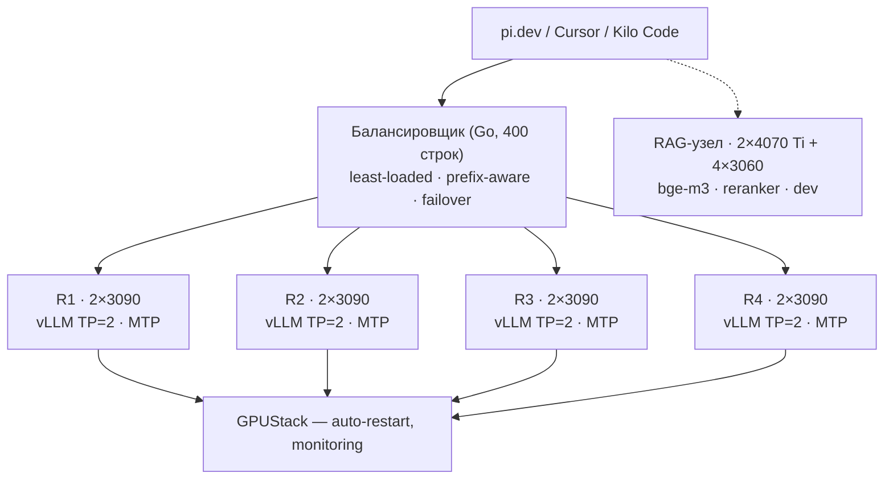

<div class="title-hero">

# 1 млрд токенов в сутки на потребительских видеокартах

</div>

<div class="subtitle">Как запускать и обслуживать LLM-модели локально</div>

<CoverBrand />

<div class="cover-meta">
  <div class="cover-author">Александр Сапронов</div>
  <div class="cover-contacts"><a href="https://t.me/axsapronov">t.me/axsapronov</a></div>
  <div class="cover-date">Data Fest Siberia 7 · Новосибирск · 10 октября 2026</div>
</div>

<style>
.title-hero h1 { font-size: 3.6rem; line-height: 1.02; color: var(--ink); }
.subtitle { margin-top: 1.4rem; font-size: 1.4rem; color: var(--ink-dim); }
.cover-meta { position: absolute; bottom: 2.5rem; left: 2.5rem; display: flex; flex-direction: column; gap: 0.3rem; }
.cover-author { font-size: 1.3rem; font-weight: 600; color: var(--ink); }
.cover-contacts { font-family: 'Geist Mono', monospace; font-size: 0.95rem; color: var(--ink-dim); }
.cover-contacts a { color: var(--ink-dim); text-decoration: none; }
.cover-contacts a:hover { color: var(--sapphire); }
.cover-date { font-family: 'Geist Mono', monospace; font-size: 0.95rem; color: var(--ink-dim); }
</style>

<!--
Приветствие, представление, 1-2 минуты.
-->

---
hideInToc: true
---

# План доклада

<Toc minDepth="1" maxDepth="1" />

---
layout: center
title: 1. Почему self-hosted LLM
---

<SectionCard kicker="Раздел 1" title="Почему self-hosted LLM" />

---
hideInToc: true
---

# Момент, когда API стал болью

<v-clicks>
- Март 2026: счёт за Claude API — **$4,200 в месяц**
- Код-агент: ~200K токенов за сессию, 10 сессий в день — **2 млн токенов/день**
- Через API — ощутимые деньги каждый день. По локальному — электричество
</v-clicks>

<div class="hook-line">Я перестал быть пользователем API и стал оператором инфраструктуры.</div>

<style>
.hook-line { margin-top: 1.6rem; font-family: 'Source Serif 4', Georgia, serif; font-size: 1.5rem; color: var(--sapphire); }
</style>

<!--
Хук: конкретный счёт, а не «API дорогой». Агент сжигает больше токенов, чем мы зарабатываем.
После этого агент работает в air-gapped среде — без лимитов провайдера и чужого uptime.
-->

---
hideInToc: true
---

# Почему не API

::left::

<div class="num-cap">Стоимость нашего объёма через API (blended $0.14–0.50/1M)</div>

| Объём в месяц | API |
|---|---:|
| 100M токенов | $14–50 |
| 500M токенов | $70–250 |
| 1B токенов | $140–500 |

::right::

<v-clicks>
- **Приватность** — данные не уходят наружу. Для RU-рынка с чувствительным кодом это не «nice to have», а требование
- **Автономность** — нет rate limits, инцидентов провайдера, региональных блокировок
- **Контроль** — я вижу каждый токен: где сгенерирован, сколько стоит, почему запрос занял 8 секунд
</v-clicks>

<style>
.num-cap { margin-top: 0.4rem; font-family: 'Geist Mono', monospace; font-size: 0.8rem; font-weight: 600; text-transform: uppercase; letter-spacing: 0.1em; color: var(--sapphire); }
</style>

<!--
«API дорогой, локально дешевле» — скучная аргументация. Для нас критичны три вещи:
приватность (RU-рынок, чувствительный код), автономность (uptime, блокировки), контроль (каждый токен виден).
-->

---
hideInToc: true
---

# Путь: от ноутбука до фермы

| Фаза | Железо | Модель | tok/s | Контекст | $/1M |
|---|---|---|---:|---:|---:|
| 0 | RTX 2060 Mobile (ноутбук) | Qwen3.5-7B Q4 | ~12 | 32K | — |
| 1 | 1×RTX 3090 (б/у, ~$700) | Qwen3.6-27B Q4 | ~35 | 64K | ~$0.5 |
| 2 | 2×RTX 3090 (TP=2) | Qwen3.8-27B-AWQ-MTP | ~75 | 256K | ~$0.3 |
| 3 | 3×(2×3090) = 6 GPU | Qwen3.8-27B-AWQ-MTP | ~75×3 | 256K | ~$0.1 |

<div class="num-cap">Сейчас: 4×(2×RTX 3090) + 2×RTX 4070 Ti + 4×RTX 3060 — инференс на 8×3090, RAG/embedding/dev на 4070 Ti и 3060</div>

<style>
.num-cap { margin-top: 1.2rem; font-family: 'Geist Mono', monospace; font-size: 0.8rem; font-weight: 600; letter-spacing: 0.05em; color: var(--sapphire); }
</style>

<!--
Цифры — из моих замеров на конкретном железе, не из документации.
Фаза 0: для чата нормально, для агента нет — 12 tok/s превращает 30-минутную задачу в полтора часа.
Фаза 1: 256K не влезало, а агенту нужна полная история + код + tool calls.
Фаза 2: один сервер — single point of failure, crash vLLM = остановленный агент.
Фаза 3: потерять один узел перестало быть катастрофой.
-->

---
layout: center
title: 2. Что дают consumer GPU
---

<SectionCard kicker="Раздел 2" title="Что дают consumer GPU" />

---
hideInToc: true
---

# Qwen — это не Claude

::left::

<div class="col-cap ok">Что он умеет</div>

- Агентный кодинг: держит длинную историю, tool calls, генерирует код
- RAG с контекстом 256K
- Работает 24/7 без лимитов и без счёта

::right::

<div class="col-cap no">Чего он не умеет</div>

- Качество не top-tier: сложный reasoning, длинные тексты — «решает» vs «почти решает»
- Заменяет Claude/GPT не для всех задач — только для своих

<div class="hook-line">Ожидания нужно резать сразу — и команда будет довольна.</div>

<style>
.col-cap { font-family: 'Geist Mono', monospace; font-size: 0.8rem; font-weight: 600; text-transform: uppercase; letter-spacing: 0.1em; margin-bottom: 0.6rem; }
.col-cap.ok { color: var(--sapphire); }
.col-cap.no { color: var(--ink-dim); }
.hook-line { margin-top: 1.4rem; font-family: 'Source Serif 4', Georgia, serif; font-size: 1.4rem; color: var(--sapphire); }
</style>

<!--
Честные ожидания: consumer-кластер решает реальные задачи (агентный кодинг, RAG, 24/7),
но не заменяет топ-модели по качеству. Разрыв виден на SWE-задачах: 42.2 vs «почти решает».
-->

---
hideInToc: true
---

# 12 моделей, 1 победитель

Протестировал на 2×3090: **8 — мусор** для агентного кодинга, 3 — нормальные, 1 — та, что у меня каждый день.

<v-clicks>
- **Агентный кодинг** (pi.dev, Cursor, Kilo) — не чат и не RAG
- **Контекст 256K** — история + код + tool calls; меньше — не работает
- **MTP** — критично для скорости на 3090
- **VRAM 24GB×2** (TP=2) — не влезает — отпадает
- **Русский язык** — для RAG-сервиса
</v-clicks>

<!--
Критерии — «какая подходит для наших задач на нашем железе», а не «какая самая умная».
Terminal-Bench и DeepSWE — рабочие метрики из пайплайна, не MMLU из таблицы.
-->

---
hideInToc: true
---

# Бенчмарки: 2×RTX 3090, vLLM, AWQ

| Модель | tok/s | TTFT (8K) | Terminal-Bench | DeepSWE |
|---|---:|---:|---:|---:|
| **Qwen3.8-27B-AWQ-MTP** | **75** | **1.8s** | **73.0** | **42.2** |
| Qwen3.6-27B | 64 | 2.0s | 63.4 | 13.3 |
| GLM-4.6 | 48 | 2.4s | 61.2 | 17.5 |
| Gemma4-26B | 66 | 2.0s | 52.4 | 8.9 |
| DeepSeek-V3.2 · Llama 4 Scout (MoE) | — | — | — | не влезает |

<div class="num-cap">Qwen3.8 — лучший *для моих задач на моём железе*, а не лучший в мире. Для другого стека победитель мог бы быть другим</div>

<style>
.num-cap { margin-top: 1.2rem; font-family: 'Geist Mono', monospace; font-size: 0.8rem; font-weight: 600; letter-spacing: 0.05em; color: var(--sapphire); }
</style>

<!--
DeepSeek-V3.2 (MoE 671B) и Llama 4 Scout (MoE 109B) — не влезает. Точка.
GLM-4.6: нет MTP, на SWE-задачах в 2.4 раза слабее Qwen3.8.
Честно: GPT-5.6 и Claude Opus не тестировал — они не влезут на 3090.
-->

---
hideInToc: true
---

# MTP: ×2.5–2.7 на 3090

::left::

<div class="code-cap">Speculative decoding</div>

```text
обычный:   [T1] → [T2] → [T3]     3 шага
MTP:       [T1 T2 T3] → verify    1 шаг
```

::right::

<v-clicks>
- Модель предсказывает **3 токена сразу**, а не 1; если «верификатор» соглашается — 3 токена за стоимость 1
- На коротких промптах: **30 → 100 tok/s (×2.5)**; на длинных генерациях — до **×2.7**
- Это не магия, а архитектура Qwen. На H100 выигрыш меньше, на «узком» consumer-железе — **решающий**
</v-clicks>

<style>
.code-cap { font-family: 'Geist Mono', monospace; font-size: 0.8rem; font-weight: 600; text-transform: uppercase; letter-spacing: 0.1em; color: var(--sapphire); }
</style>

<!--
MTP-головы — архитектурное решение Qwen. Decode на 3090 упирается в пропускную способность памяти,
поэтому спекулятивное декодирование даёт здесь больше, чем на H100.
-->

---
hideInToc: true
---

# 3090: что НЕ работает (честно)

<v-clicks>
- **Нет нативного FP8** — Ampere, не Ada и не Hopper. Поэтому квантую в AWQ (INT4), а не FP8
- **NVLink-мосты не используются** — TP=2 работает по PCIe 4.0; для 27B этого достаточно (замерено)
- **24GB VRAM — потолок** — 256K контекст + 27B веса = постоянный расчёт «что влезает, а что нет»
</v-clicks>

<div class="hook-line">Я не собирал H100-кластер. Я собирал то, что было доступно и по карману — и этого хватило.</div>

<style>
.hook-line { margin-top: 1.6rem; font-family: 'Source Serif 4', Georgia, serif; font-size: 1.5rem; color: var(--sapphire); }
</style>

<!--
Риторика «consumer GPU — это компромисс» верна, но компромисс посчитан:
нет FP8/NVLink, 24GB потолок — и при этом 1 млрд токенов/сутки.
-->

---
layout: center
title: "3. Как это реально запускать: GPUStack + vLLM"
---

<SectionCard kicker="Раздел 3" title="Как это реально запускать: GPUStack + vLLM" />

---
hideInToc: true
---

# Финальная архитектура



<!--
Клиенты — код-агенты. Балансировщик — 400 строк Go (раздел 4).
Каждая реплика — 2×3090, TP=2, MTP, конфиг из раздела 3.
GPUStack управляет репликами и поднимает их после crash.
RAG-узел — отдельное железо: 4070 Ti и 3060 под bge-m3, reranker и dev.
-->

---
hideInToc: true
---

# Первый запуск: 18 tok/s

::left::

<div class="code-cap">vLLM 0.27.1, конфиг по умолчанию</div>

```bash
vllm serve Qwen3.8-27B-AWQ-MTP \
  --tensor-parallel-size 2
```

::right::

18 tok/s. TTFT 4.2s. «Работает, но это не то».

<v-clicks>
- **Не настроил MTP** — модель с MTP-головами гонялась в обычном режиме: 1 токен за итерацию
- **Не настроил KV-cache** — контекст 32K по умолчанию, 256K не заявлен
- **OMP_NUM_THREADS по умолчанию** — CPU-многопоточность создаёт overhead, а не ускорение
</v-clicks>

<style>
.code-cap { font-family: 'Geist Mono', monospace; font-size: 0.8rem; font-weight: 600; text-transform: uppercase; letter-spacing: 0.1em; color: var(--sapphire); }
</style>

<!--
Все три ошибки — дефолты. Первый конфиг — baseline, и именно он показал, где боль.
-->

---
hideInToc: true
---

# Тюнинг: 4 итерации, по одной переменной

| Итерация | Что изменил | Результат |
|---|---|---|
| 1 | MTP: 3 спекулятивных токена | 18 → 45 tok/s (×2.5) |
| 2 | 256K контекст + max-num-seqs 2 | 256K влез: KV-cache съедает ~18GB |
| 3 | OMP_NUM_THREADS=1, без async scheduling | TTFT 4.2s → 1.8s |
| 4 | mamba-cache-mode align | +5 tok/s |

<v-clicks>
- **Итог: 18 → 75 tok/s (×4.2), контекст 32K → 256K.** Цена: параллельность 8 → 2 запроса — для агента ок, он генерирует последовательно
- **Crash:** MTP в vLLM 0.27.1 — wild write, vLLM умер на 3-й день. Лечится upgrade на 0.28.0
</v-clicks>

<!--
Каждая итерация — одна переменная, иначе не понять, что дало эффект.
max-num-seqs 2 — честный компромисс: жертвуем параллельностью ради 256K контекста.
2 недели на нестабильном 0.27.1 — потерянное время; версия рантайма — часть тюнинга.
-->

---
hideInToc: true
---

# Финальный конфиг

::left::

```bash
vllm serve Qwen3.8-27B-AWQ-MTP \
  --tensor-parallel-size 2 \
  --max-model-len 262144 \
  --max-num-seqs 2 \
  --speculative-config '{"method": "mtp",
    "num_speculative_tokens": 3}' \
  --mamba-cache-mode align \
  --disable-async-scheduling \
  --gpu-memory-utilization 0.92
# OMP_NUM_THREADS=1
```

::right::

<div class="num-cap">Что я НЕ делал (и почему)</div>

<v-clicks>
- **NVFP4** — не поддерживается на Ampere
- **TRT-LLM / TensorRT** — не нужны, vLLM достаточно
- **8 параллельных запросов** — для агента 2 достаточны; 8 — это жертва контекстом и TTFT ради throughput, который мне не нужен
</v-clicks>

<style>
.num-cap { font-family: 'Geist Mono', monospace; font-size: 0.8rem; font-weight: 600; text-transform: uppercase; letter-spacing: 0.1em; color: var(--sapphire); }
</style>

<!--
Полный финальный конфиг — 4 параметра тюнинга + дефолты, которые важно не трогать.
NVFP4 и TRT-LLM из 0.28.0 — фичи Hopper/Blackwell, на Ampere бесполезны.
-->

---
layout: center
title: 4. Какие метрики важны
---

<SectionCard kicker="Раздел 4" title="Какие метрики важны и сколько чего надо" />

---
hideInToc: true
---

# NGINX не понимает LLM

::left::

<v-clicks>
- Round-robin — это как раздавать билеты в кино: кто пришёл, тот сел. Но LLM-запрос — не билет
- **LLM-запрос — это состояние (KV-cache).** Реплика с полным кэшем не «занята», она «дорогая»: каждый новый токен на ней стоит дороже
- NGINX — кондуктор в автобусе: знает, сколько людей в салоне, но не знает, кто едет 3 остановки, а кто — 30
</v-clicks>

::right::

<div class="num-cap">Мой роутер (Go, 400 строк)</div>

- **least-loaded** — минимальный active_seqs / max_seqs
- **prefix-aware** — тот же system prompt уже в кэше → туда
- **context-aware** — prompt > 100K → реплика с максимальным свободным KV-cache
- **failover** — 5s без ответа → убрать из пула, retry на другой

<style>
.num-cap { font-family: 'Geist Mono', monospace; font-size: 0.8rem; font-weight: 600; text-transform: uppercase; letter-spacing: 0.1em; color: var(--sapphire); margin-bottom: 0.6rem; }
</style>

<!--
Round-robin «не сломан» — он просто отвечает на другой вопрос.
Ключевая мысль: балансировка LLM — про состояние (KV-cache), а не про соединения.
-->

---
hideInToc: true
---

# Бенчмарк: NGINX vs мой балансировщик

| Метрика | NGINX RR | Мой балансировщик |
|---|---:|---:|
| P50 latency | 2.1s | **1.4s** |
| P99 latency | 8.7s | **3.2s** |
| Throughput (tok/s, aggregate) | 180 | **210** |
| KV-cache hit rate | 12% | **34%** |
| Failover | 30s (timeout) | **5s** |

<div class="num-cap">P99 ниже в 2.7 раза, KV-cache hit rate выше почти в 3 раза — прямая работа prefix-aware routing · 400 строк Go, не 4000: для 30 реплик нужен K8s</div>

<style>
.num-cap { margin-top: 1.2rem; font-family: 'Geist Mono', monospace; font-size: 0.8rem; font-weight: 600; letter-spacing: 0.05em; color: var(--sapphire); }
</style>

<!--
Failover 5s против 30s — разница между «сбоем» и «просто задержкой».
Prefix caching — «бесплатный» throughput: 12% → 34% hit rate без изменения железа.
-->

---
hideInToc: true
---

# Тономика: $3,200/год против $20–73K

| Параметр | Значение |
|---|---:|
| Железо (3×2×RTX 3090, б/у) | ~$4,200 (разово) |
| Электричество (6×350W, 24/7) | ~$1,800/год |
| Амортизация (3 года) | ~$1,400/год |
| **Итого** | **~$3,200/год** |
| API-эквивалент (blended $0.14–0.50/1M) | ~$20–73K/год |
| **1M токенов при пике** | **~$0.009** |
| **Payback** | **~1.5 месяца** |

<div class="num-cap">1 млрд токенов/сутки — пик (8–12 часов агентного кодинга); в среднем 300–500M/сутки. Пик определяет размер инфраструктуры, средний — экономику</div>

<style>
.num-cap { margin-top: 1.2rem; font-family: 'Geist Mono', monospace; font-size: 0.8rem; font-weight: 600; letter-spacing: 0.05em; color: var(--sapphire); }
</style>

<!--
Цифры — для ядра фермы 6×3090 (замеры из блога); ферма с тех пор выросла до 8×3090 + RAG-узел.
Момент честности: «1 млрд» — это total (input + output), в агентных нагрузках доминирует input
(256K контекст, RAG, tool calls при генерации 1–5K). Prefill проходит на порядки быстрее decode.
-->

---
hideInToc: true
---

# Что я бы сделал по-другому

<v-clicks>
1. **Железо:** 4×3090 (TP=4) вместо 3×(2×3090) — один узел проще. Но 1.4kW: блок питания не потянул
2. **Модель:** 3 кандидата вместо 12 — Qwen3.8, DeepSeek-V3.2, GLM-4.6; 3 дня до решения
3. **vLLM:** сразу 0.28.0 — 2 недели на нестабильном 0.27.1 это потерянное время
4. **Балансировщик:** не писал бы свой — GPUStack + NGINX; prefix-aware — 20% кода за ~5% gain
5. **Мониторинг:** Prometheus + Grafana с первого дня — 2 недели летал вслепую, crash на MTP нашёл по логам, а не по алерту
</v-clicks>

<!--
Это и есть «шоколад, который неприятно воняет»: каждый пункт — реальная ошибка с ценой.
Подчеркнуть: мониторинг — самая дешёвая и самая забытая вещь в списке.
-->

---
layout: center
title: 5. Заключение
---

<SectionCard kicker="Раздел 5" title="Заключение" />

---
hideInToc: true
---

# Заключение

<v-clicks>
- **1 млрд токенов в сутки — это не про железо.** Это про то, что я перестал быть пользователем API и стал оператором инфраструктуры
- Команда довольна: TTFT 1.8s, 75–100 tok/s на пользователя, 256K контекст, P99 3.2s, ~$0.009 за 1M токенов
- **Qwen — не Claude**, но для агентной нагрузки его хватает — и он на порядок дешевле API
</v-clicks>

<div class="hook-line">Это не конец, а checkpoint. Через 6 месяцев я это перепишу.</div>

<style>
.hook-line { margin-top: 1.6rem; font-family: 'Source Serif 4', Georgia, serif; font-size: 1.5rem; color: var(--sapphire); }
</style>

<!--
Финал: 24/7, без лимитов, без счетов, без зависимости от чужого uptime — и это стоит $3,200/год,
а не $20–73K. Roadmap: Qwen4 (3090 не потянет — нужен 4090/H100), RAG-сервис, AI Gateway.
-->

---
layout: center
hideInToc: true
---

<div class="thanks">
  <h1 class="thanks-title">Спасибо!</h1>
  <div class="thanks-sub">Вопросы?</div>

  <div class="thanks-contact">
    <div class="thanks-name">Александр Сапронов</div>
    <div class="thanks-links"><a href="mailto:a@sapronov.me">a@sapronov.me</a> · <a href="https://t.me/axsapronov">t.me/axsapronov</a></div>
  </div>

  <QrCode url="https://github.com/axsapronov/datafestsiberia7-self-hosted-llm" :size="124" caption="Ссылка на слайды" />
</div>

<style>
.thanks { display: flex; flex-direction: column; align-items: center; gap: 1.1rem; text-align: center; }
.thanks-title { font-size: 4rem; line-height: 1.05; }
.thanks-sub { font-family: 'Source Serif 4', Georgia, serif; font-size: 2rem; color: var(--sapphire); }
.thanks-contact { display: flex; flex-direction: column; gap: 0.3rem; margin-top: 0.4rem; }
.thanks-name { font-size: 1.3rem; font-weight: 600; color: var(--ink); }
.thanks-links { font-family: 'Geist Mono', monospace; font-size: 1rem; color: var(--ink-dim); }
.thanks-links a { color: var(--ink-dim); text-decoration: none; }
.thanks-links a:hover { color: var(--sapphire); }
</style>

<!--
Финал: Q&A, ссылки, контакты.
-->
